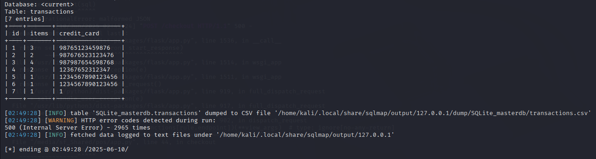

# Contents {#contents .TOC-Heading}

[List of Tables [3](#list-of-tables)](#list-of-tables)

[List of Figures [3](#list-of-figures)](#list-of-figures)

[2 Chapter -- 1 [4](#chapter-1)](#chapter-1)

[2.1 Introduction [4](#introduction)](#introduction)

[2.2 Ability in searching specific IoT devices
[4](#ability-in-searching-specific-iot-devices)](#ability-in-searching-specific-iot-devices)

[3 Chapter -- 2: IOT SECURITY CHALLENGES
[6](#chapter-2-iot-security-challenges)](#chapter-2-iot-security-challenges)

[3.1 Weak Authentication & Authorization
[6](#weak-authentication-authorization)](#weak-authentication-authorization)

[3.2 Insecure Communication & Data Privacy Risks
[6](#insecure-communication-data-privacy-risks)](#insecure-communication-data-privacy-risks)

[3.3 Vulnerable Firmware & Lack of Updates
[6](#vulnerable-firmware-lack-of-updates)](#vulnerable-firmware-lack-of-updates)

[3.4 Physical Security Risk
[7](#physical-security-risk)](#physical-security-risk)

[3.5 Botnets and DDoS Attacks
[7](#botnets-and-ddos-attacks)](#botnets-and-ddos-attacks)

[3.6 Insecure APIs and Cloud Integrations
[7](#insecure-apis-and-cloud-integrations)](#insecure-apis-and-cloud-integrations)

[3.7 Supply Chain and Third-Party Risks
[7](#supply-chain-and-third-party-risks)](#supply-chain-and-third-party-risks)

[3.8 Lack of Standardization and Regulation
[8](#lack-of-standardization-and-regulation)](#lack-of-standardization-and-regulation)

[3.9 Insider Threats and Misconfiguration
[8](#insider-threats-and-misconfiguration)](#insider-threats-and-misconfiguration)

[4 Chapter -- 3: Related Works
[9](#chapter-3-related-works)](#chapter-3-related-works)

[4.1 A Large-scale Empirical Study on the Vulnerability of Deployed IoT
Devices
[9](#a-large-scale-empirical-study-on-the-vulnerability-of-deployed-iot-devices)](#a-large-scale-empirical-study-on-the-vulnerability-of-deployed-iot-devices)

[4.2 Security Assessment of an Internet of Thing Device
[9](#security-assessment-of-an-internet-of-thing-device)](#security-assessment-of-an-internet-of-thing-device)

[4.3 Forensic analysis and security assessment of IoT camera firmware
for smart homes
[10](#forensic-analysis-and-security-assessment-of-iot-camera-firmware-for-smart-homes)](#forensic-analysis-and-security-assessment-of-iot-camera-firmware-for-smart-homes)

[4.4 A Survey on Verification of Security and Safety in IoT Systems
[10](#a-survey-on-verification-of-security-and-safety-in-iot-systems)](#a-survey-on-verification-of-security-and-safety-in-iot-systems)

[5 Chapter -- 4: PROTOTYPE SETUP
[12](#chapter-4-prototype-setup)](#chapter-4-prototype-setup)

[5.1 The Data Flow Diagrams of the system
[12](#the-data-flow-diagrams-of-the-system)](#the-data-flow-diagrams-of-the-system)

[5.2 Mobile App for Smart Shopping Mall Interaction
[12](#mobile-app-for-smart-shopping-mall-interaction)](#mobile-app-for-smart-shopping-mall-interaction)

[5.2.1 Dashboard [13](#dashboard)](#dashboard)

[5.2.2 Map [13](#map)](#map)

[5.2.3 Store Directory [14](#store-directory)](#store-directory)

[5.2.4 Deals [14](#deals)](#deals)

[5.2.5 Profile [14](#profile)](#profile)

[5.3 Wi-Fi Router Network
[15](#wi-fi-router-network)](#wi-fi-router-network)

[5.3.1 Router setup configuration
[15](#router-setup-configuration)](#router-setup-configuration)

[5.4 Video Surveillance System
[16](#video-surveillance-system)](#video-surveillance-system)

[5.5 Smart control system for lights and other electricals
[17](#smart-control-system-for-lights-and-other-electricals)](#smart-control-system-for-lights-and-other-electricals)

[5.5.1 AWS IoT Core configuration
[19](#aws-iot-core-configuration)](#aws-iot-core-configuration)

[5.5.2 ESP8266 NodeMCU Firmware
[19](#esp8266-nodemcu-firmware)](#esp8266-nodemcu-firmware)

[5.5.3 RSA for Certificate-Based Authentication
[19](#rsa-for-certificate-based-authentication)](#rsa-for-certificate-based-authentication)

[5.5.4 TLS Handshake (Using RSA Key Exchange)
[19](#tls-handshake-using-rsa-key-exchange)](#tls-handshake-using-rsa-key-exchange)

[5.5.5 Node-RED Dashboard Setup
[20](#node-red-dashboard-setup)](#node-red-dashboard-setup)

[5.6 Point of Sale (POS) system
[22](#point-of-sale-pos-system)](#point-of-sale-pos-system)

[6 Chapter -- 5: Vulnerability Detection Tools
[23](#chapter-5-vulnerability-detection-tools)](#chapter-5-vulnerability-detection-tools)

[6.1.1 Network Security Testing Tools
[24](#_Toc200719498)](#_Toc200719498)

[6.1.2 Mobile App Security Testing Tools
[25](#mobile-app-security-testing-tools)](#mobile-app-security-testing-tools)

[6.1.3 Database Security Testing Tools
[26](#database-security-testing-tools)](#database-security-testing-tools)

[6.1.4 IoT Device Security Testing Tools
[27](#iot-device-security-testing-tools)](#iot-device-security-testing-tools)

[6.1.5 MQTT Protocol Testing Tools
[28](#mqtt-protocol-testing-tools)](#mqtt-protocol-testing-tools)

[7 Chapter -- 6: Vulnerability Detection
[29](#chapter-6-vulnerability-detection)](#chapter-6-vulnerability-detection)

[7.1 Vulnerability Detection by Component
[29](#vulnerability-detection-by-component)](#vulnerability-detection-by-component)

[7.1.1 Wi-Fi Router Network
[29](#wi-fi-router-network-1)](#wi-fi-router-network-1)

[7.1.2 Mobile App (mallConnect)
[30](#mobile-app-mallconnect)](#mobile-app-mallconnect)

[7.1.3 IP-Based Video Surveillance System
[30](#ip-based-video-surveillance-system)](#ip-based-video-surveillance-system)

[7.2 Smart Control System
[32](#smart-control-system)](#smart-control-system)

[7.3 Point of Sale (POS) System
[32](#point-of-sale-pos-system-1)](#point-of-sale-pos-system-1)

[8 Chapter -- 7: Results and analysis
[35](#chapter-7-results-and-analysis)](#chapter-7-results-and-analysis)

[8.1 Wi-Fi Router Network
[35](#wi-fi-router-network-2)](#wi-fi-router-network-2)

[8.2 Mobile App (mallConnect)
[35](#mobile-app-mallconnect-1)](#mobile-app-mallconnect-1)

[8.3 IP-Based Video Surveillance System
[35](#ip-based-video-surveillance-system-1)](#ip-based-video-surveillance-system-1)

[8.4 Smart Control System
[36](#smart-control-system-1)](#smart-control-system-1)

[8.5 Point of Sale (POS) System
[36](#point-of-sale-pos-system-2)](#point-of-sale-pos-system-2)

[8.6 Comparative Tool Effectiveness
[36](#comparative-tool-effectiveness)](#comparative-tool-effectiveness)

[8.7 Overall Analysis [36](#overall-analysis)](#overall-analysis)

[9 Chapter -- 8: Future Scope
[38](#chapter-8-future-scope)](#chapter-8-future-scope)

[9.1 Enhanced Vulnerability Detection for the Smart Control System
(Section 6.4)
[38](#enhanced-vulnerability-detection-for-the-smart-control-system-section-6.4)](#enhanced-vulnerability-detection-for-the-smart-control-system-section-6.4)

[9.2 Advanced Security Testing for the Mobile App (mallConnect) (Section
6.2)
[38](#advanced-security-testing-for-the-mobile-app-mallconnect-section-6.2)](#advanced-security-testing-for-the-mobile-app-mallconnect-section-6.2)

[9.3 Development of Comprehensive Mitigation Strategies
[38](#development-of-comprehensive-mitigation-strategies)](#development-of-comprehensive-mitigation-strategies)

[10 Chapter-9: Conclusion
[39](#chapter-9-conclusion)](#chapter-9-conclusion)

[11 References [40](#references)](#references)

**\
**

## List of Tables {#list-of-tables .list-paragraph}

[Table 1‑1 [15](#_Toc200718677)](#_Toc200718677)

[Table 1‑2 [15](#_Toc200718678)](#_Toc200718678)

[Table 2‑1 [16](#_Toc200718679)](#_Toc200718679)

[Table 2‑2: Key Risks [17](#_Toc200718680)](#_Toc200718680)

[Table 6‑1: Capturing packets using Wireshark.
[41](#_Toc200718681)](#_Toc200718681)

[Table 6‑2: Checking open ports for the selected IP
[41](#_Toc200718682)](#_Toc200718682)

[Table 6‑3: Successfully accessing CCTV Portal without authentication
[42](#_Toc200718683)](#_Toc200718683)

[Table 6‑4: Checking for SQL vulnerability using blind SQL injection
[42](#_Toc200718684)](#_Toc200718684)

[Table 6‑5: Confirmation of presence of SQL injection vulnerability
[43](#_Toc200718685)](#_Toc200718685)

[Table 6‑6: Finding Request Payload
[43](#_Toc200718686)](#_Toc200718686)

[Table 6‑7: Using Sqlmap to find out tables inside the database
[44](#_Toc200718687)](#_Toc200718687)

[Table 6‑8: Dumping data using sqlmap
[44](#_Toc200718688)](#_Toc200718688)

[Table 6‑9: Dumping data using sqlmap
[44](#_Toc200718689)](#_Toc200718689)

[Table 7‑1: Effectiveness of Vulnerability Detection Tools
[46](#_Toc200718690)](#_Toc200718690)

## List of Figures {#list-of-figures .list-paragraph}

[Figure 1‑1: Smart Shopping Mall [14](#_Toc200718691)](#_Toc200718691)

[Figure 4‑1: (Data Flow Diagram) DFD Level 0
[22](#_Toc200718692)](#_Toc200718692)

[Figure 4‑2: (Data Flow Diagram) DFD Level 1
[22](#_Toc200718693)](#_Toc200718693)

[Figure 4‑3: five parts of the App [23](#_Toc200718694)](#_Toc200718694)

[Figure 4‑4: Dashboard [23](#_Toc200718695)](#_Toc200718695)

[Figure 4‑5: Map page [23](#_Toc200718696)](#_Toc200718696)

[Figure 4‑6: Store Direction [24](#_Toc200718697)](#_Toc200718697)

[Figure 4‑7: Profile page [24](#_Toc200718698)](#_Toc200718698)

[Figure 4‑8: Database schema for mallConnect Mobile App
[25](#_Toc200718699)](#_Toc200718699)

[Figure 4‑9: Setting router to auto configure.
[25](#_Toc200718700)](#_Toc200718700)

[Figure 4‑10: Router general settings.
[25](#_Toc200718701)](#_Toc200718701)

[Figure 4‑11: Router general settings.
[26](#_Toc200718702)](#_Toc200718702)

[Figure 4‑12: Raspberry Pi 4 Model B
[26](#_Toc200718703)](#_Toc200718703)

[Figure 4‑13: CCTV Camera [27](#_Toc200718704)](#_Toc200718704)

[Figure 4‑14: Surveillance dashboard
[27](#_Toc200718705)](#_Toc200718705)

[Figure 4‑15: Smart control system for lights and other electricals
[28](#_Toc200718706)](#_Toc200718706)

[Figure 4‑16: MQTT Communication [28](#_Toc200718707)](#_Toc200718707)

[Figure 4‑17: AWS IoT Core configuration
[29](#_Toc200718708)](#_Toc200718708)

[Figure 4‑18: Hardware setup of the Lighting System
[30](#_Toc200718709)](#_Toc200718709)

[Figure 4‑19: Node-RED Dashboard Setup
[31](#_Toc200718710)](#_Toc200718710)

[Figure 4‑20: Configuration dashboard
[31](#_Toc200718711)](#_Toc200718711)

[Figure 4‑21: User interface dashboard
[31](#_Toc200718712)](#_Toc200718712)

[Figure 4‑22: Point of Sale Home page
[32](#_Toc200718713)](#_Toc200718713)

[Figure 4‑23: Point of Sale Add Product page
[32](#_Toc200718714)](#_Toc200718714)

[Figure 4‑24: Point of Sale Checkout Page
[33](#_Toc200718715)](#_Toc200718715)

[Figure 4‑25: Point of Sale Search Product Page
[33](#_Toc200718716)](#_Toc200718716)

# Chapter -- 1

## Introduction

In today\'s digitally connected world, the Internet of Things (IoT) has
transformed the way we interact with technology, particularly in
innovative environments like smart shopping malls. These malls leverage
IoT to enhance customer experiences, streamline operations, and optimize
resource management through devices such as smart lighting, automated
climate control systems, intelligent surveillance cameras, and connected
point-of-sale systems. From interactive digital kiosks to smart parking
sensors, IoT devices create a seamless, efficient, and personalized
shopping experience.

{width="2.9930555555555554in"
height="2.4166666666666665in"}

[]{#_Toc200718691 .anchor}Figure ‑: Smart Shopping Mall

However, the rapid proliferation of internet-connected devices in smart
shopping malls has exposed the limitations of IPv4 (Internet Protocol
version 4). With its 32-bit address space, IPv4 offers only about 4.3
billion unique addresses---a number insufficient to support the growing
number of IoT devices, smartphones, and computers. To address this
scarcity, the networking industry has transitioned to IPv6 (Internet
Protocol version 6), which uses a 128-bit address space, providing
approximately 340 undecillion (3.4 × 10³⁸) unique addresses. This vast
address pool ensures that smart shopping malls can integrate an
ever-expanding array of IoT devices without connectivity constraints.

Various IoT devices in smart shopping malls, such as routers, IP
cameras, smart displays, and environmental control systems, are exposed
to the internet, making them potential targets for cyber threats.
Information about these exposed devices can be gathered using IoT search
engines like Shodan, Censys, Zoomeye, Fofa, and NTI, as explored in the
paper A Large-scale Empirical Study on the Vulnerability of Deployed IoT
Devices. Understanding and addressing the vulnerabilities of these
devices is critical to ensuring the security and reliability of smart
shopping mall ecosystems.

## Ability in searching specific IoT devices

They had performed considerable studies about how the different search
engine performs in detecting the exposed IP-based device, and they found
some data about it.

[]{#_Toc200718677 .anchor}Table ‑

  ---------------------------------------------------------------------------------
  Devices      Vendors     Zoomeye     Shodan     Censys     Fofa       NTI
  ------------ ----------- ----------- ---------- ---------- ---------- -----------
  Router       TP-link     10,47,861   2,48,062   2,61,149   9,24,950   7,43,119

  IP camera    Hikvision   36,07,552   1,30,836   1,24,238   4,27,935   27,49,631

  Printer      HP          2,10,507    1,19,186   87,343     1,48,309   1,27,625

  Antminer     Bitman      1,158       344        306        2,619      792

  PACS         Dicoogle    10          1          2          1          0

  ModbusGW     Modbus      47          14         8          9          36
  ---------------------------------------------------------------------------------

From above comparison, we can conclude that Zoomeye's performance is
better than others, then Shodan, Censys, Fofa, and NTI, respectively.
Now let's see the response time of these search engines to a newly
launched system on the internet, which is open by accessing the IP
address.

[]{#_Toc200718678 .anchor}Table ‑

+-----+------+-------+-------+-------+-------+-------+------+-------+
| IP  |      | 35.   | 35.   | 35    | 47    | 47    | 66.  | 45.   |
| A   |      | 236.1 | 243.6 | .199. | .88.6 | .75.4 | 42.9 | 77.23 |
| ddr |      | 4.159 | 5.199 | 71.88 | 3.131 | 3.192 | 4.35 | 2.219 |
| ess |      |       |       |       |       |       |      |       |
+=====+======+=======+=======+=======+=======+=======+======+=======+
| Lo  |      | L     | T     | São   | Santa | Hong  | Atla | Sy    |
| cat |      | osAng | okyo, | P     | C     | kong, | nta, | dney, |
| ion |      | eles, |       | aulo, | lara, |       | U.S. |       |
|     |      | US    | Japan |       |       | China |      | Aust  |
|     |      |       |       | B     | U.S,  |       |      | ralia |
|     |      |       |       | razil |       |       |      |       |
+-----+------+-------+-------+-------+-------+-------+------+-------+
| Cr  |      | 11/19 | 11/19 | 11/19 | 11/19 | 11/19 | 11   | 11/19 |
| eat |      | /2018 | /2018 | /2018 | /2018 | /2018 | /19/ | /2018 |
| ion |      |       |       |       |       |       | 2018 |       |
| T   |      |       |       |       |       |       |      |       |
| ime |      |       |       |       |       |       |      |       |
+-----+------+-------+-------+-------+-------+-------+------+-------+
| Z   | Re   | 12-07 | 12-07 | 12-07 | 12-07 |       | 12   | 12/14 |
| oom | spon | -2018 | -2018 | -2018 | -2018 |       | -08- | /2018 |
| eye | ding |       |       |       |       |       | 2018 |       |
|     | Time |       |       |       |       |       |      |       |
+-----+------+-------+-------+-------+-------+-------+------+-------+
|     | Scan | \-    | \-    | \-    | \-    | \-    | 19   | 21    |
|     | ning |       |       |       |       |       | days | days  |
|     | Pe   |       |       |       |       |       |      |       |
|     | riod |       |       |       |       |       |      |       |
+-----+------+-------+-------+-------+-------+-------+------+-------+
| Sho | Re   | 11/21 | 11/21 | 11-04 | 12-10 | 12-01 | 11   | 11/24 |
| dan | spon | /2018 | /2018 | -2018 | -2018 | -2018 | /22/ | /2018 |
|     | ding |       |       |       |       |       | 2018 |       |
|     | Time |       |       |       |       |       |      |       |
+-----+------+-------+-------+-------+-------+-------+------+-------+
|     | Scan | 16    | 16    | 14    | 17    | 15    | 15   | 17    |
|     | ning | days  | days  | days  | days  | days  | days | days  |
|     | Pe   |       |       |       |       |       |      |       |
|     | riod |       |       |       |       |       |      |       |
+-----+------+-------+-------+-------+-------+-------+------+-------+
| Cen | Re   | 11/20 | 11/20 | 11/20 |       | 12-11 | 11   | 11/20 |
| sys | spon | /2018 | /2018 | /2018 |       | -2018 | /20/ | /2018 |
|     | ding |       |       |       |       |       | 2018 |       |
|     | Time |       |       |       |       |       |      |       |
+-----+------+-------+-------+-------+-------+-------+------+-------+
|     | Scan | \-    | 24    | \-    | \-    | \-    | \-   | \-    |
|     | ning |       | days  |       |       |       |      |       |
|     | Pe   |       |       |       |       |       |      |       |
|     | riod |       |       |       |       |       |      |       |
+-----+------+-------+-------+-------+-------+-------+------+-------+
| F   | Re   | 12-05 | 12-05 | 12-10 |       | 12-06 | 12   | 12-02 |
| ofa | spon | -2018 | -2018 | -2018 |       | -2018 | -07- | -2018 |
|     | ding |       |       |       |       |       | 2018 |       |
|     | Time |       |       |       |       |       |      |       |
+-----+------+-------+-------+-------+-------+-------+------+-------+
|     | Scan | 19    | 22    | 15    | \-    | 16    | 20   | 18    |
|     | ning | days  | days  | days  |       | days  | days | days  |
|     | Pe   |       |       |       |       |       |      |       |
|     | riod |       |       |       |       |       |      |       |
+-----+------+-------+-------+-------+-------+-------+------+-------+
| NTI | Re   | 11/27 | 12-05 | 11/30 | 12-01 | 12-02 | 11   | 12-06 |
|     | spon | /2018 | -2018 | /2018 | -2018 | -2018 | /21/ | -2018 |
|     | ding |       |       |       |       |       | 2018 |       |
|     | Time |       |       |       |       |       |      |       |
+-----+------+-------+-------+-------+-------+-------+------+-------+
|     | Scan | \-    | 17    | \-    | 18    | 21    | \-   | \-    |
|     | ning |       | days  |       | days  | days  |      |       |
|     | Pe   |       |       |       |       |       |      |       |
|     | riod |       |       |       |       |       |      |       |
+-----+------+-------+-------+-------+-------+-------+------+-------+

They keep these servers for 60 days live to the internet so that they
can visualize how much time a search engine would take to list a newly
exposed device. Three of the seven servers are from Google Cloud,
located in Los Angeles, Tokyo, and Sao Paulo, two of them are from
Alibaba Cloud, located in Santa Clara and Hong Kong, and the remaining
two are from Vultr, located in Atlanta and Sydney. In this table, the
scanning period refers to the time between two contiguous scans.

#  Chapter -- 2: IOT SECURITY CHALLENGES

IoT device vulnerability detection is crucial for ensuring security,
especially since IoT devices are often targeted due to weak
authentication, outdated firmware, and insecure communication channels.
Here's a structured approach to detecting vulnerabilities in IoT
devices. So here we will find vulnerabilities of the IOT based Smart
Shopping System and prevent it from exploitation by attackers.

## Weak Authentication & Authorization

Common Risks:

-   Using weak or default passwords^\[7\]^

-   Absence of multi-factor authentication (MFA)

-   Inadequate or non-existent session management

-   Inadequate access control, which allows users to access data without
    authorization

-   Insecure direct object references (IDOR)^\[1\]^

    1.  ## Insecure Communication & Data Privacy Risks

[]{#_Toc200718679 .anchor}Table ‑

  ------------------------------------------------------------------------
  Risk Area                Example                  Impact
  ------------------------ ------------------------ ----------------------
  **Unencrypted            Using HTTP instead of    Allows packet sniffing
  Traffic^\[2\]^**         HTTPS                    and MITM attacks

  **Weak SSL/TLS           Deprecated protocols     Enables protocol
  Config^\[4\]^**          (e.g., SSL 3.0)          downgrade or cipher
                                                    attacks

  **Insecure APIs**        No TLS or lack of        Sensitive data
                           authentication           exposure

  **Data in Plaintext at   Files or databases not   Compromise on server
  Rest**                   encrypted                gives full data access

  **Improper Certificate   Self-signed or expired   Opens door to MITM
  Handling**               certs                    attacks

  **Missing HSTS/HTTP      No strict security       Reduces resistance to
  Security Headers**       policies                 attack vectors
  ------------------------------------------------------------------------

These risks relate to data security lapses that occur during
transmission or storage, giving hackers the ability to intercept, read,
or alter private data.

## Vulnerable Firmware & Lack of Updates

This category describes the dangers that come with devices running
out-of-date, unpatched, or insecure firmware, particularly embedded
systems, the Internet of Things, or hardware appliances. These flaws can
be used by attackers to install malware, obtain enduring access, or take
over a system completely.

[]{#_Toc200718680 .anchor}Table ‑: Key Risks

  ------------------------------------------------------------------------
  Risk Area           Description               Impact
  ------------------- ------------------------- --------------------------
  **Outdated          Devices running old       Easily exploitable
  Firmware^\[2\]^**   versions with known CVEs  vulnerabilities

  **No Update         No way to patch bugs or   Long-term exposure
  Mechanism**         security flaws            

  **Insecure Update   Updates not verified or   Risk of malicious firmware
  Process^\[11\]^**   signed                    installation (supply chain
                                                attack)

  **Hardcoded         Backdoors or built-in     Easy access for attackers
  Credentials in      default credentials       
  Firmware**                                    

  **Lack of           No changelogs, update     Admins unaware of critical
  Transparency**      logs, or visibility       patches
  ------------------------------------------------------------------------

## Physical Security Risk

Threats resulting from illegal physical access to computer
infrastructure, such as servers, network hardware, or Internet of Things
devices, are referred to as physical security hazards. Physical attacks,
as opposed to remote cyberattacks, have the potential to directly
manipulate or steal hardware^\[4\]^, resulting in data breaches,
confidentiality breaches, or irreversible damage. Examples include
stealing items like laptops or hard drives, breaking into data centres,
or gaining access to unsecured USB connections. These hazards are made
worse by a lack of environmental protections (such as flood or fire
protection), access controls, or surveillance systems.

## Botnets and DDoS Attacks

A botnet is a collection of malware-infected internet-connected devices
that are under the control of a malevolent actor, frequently without the
owners\' awareness. Distributed Denial of Service (DDoS) assaults, which
bombard a target system, like a website or server, with excessive
traffic, causing it to crash or become unusable, are commonly launched
by these botnets. These attacks have the potential to impair client
satisfaction, interfere with business operations, and result in
financial loss. Poorly secured devices are frequently taken over by
botnets (like the Mirai botnet)^\[8\]^ as IoT use rises, greatly
increasing the scope of attacks.

## Insecure APIs and Cloud Integrations

Modern applications and cloud environments depend on Application
Programming Interfaces (APIs) to facilitate data interchange and
communication between systems. However, APIs become easy targets for
attackers when they are insecure^\[1\]\[4\]^, which can be caused by
inadequate encryption, weak authentication, inadequate access control,
or a lack of rate limitation. Cloud integration flaws could make private
information public, permit privilege escalation, or permit illegal
access to services. The intricacy of multi-cloud and hybrid settings
frequently results in inconsistent security rules or incorrect
configurations, which raises the risk even further.

## Supply Chain and Third-Party Risks

For system development and maintenance, organizations frequently rely on
outside suppliers, service providers, and software components. Supply
chain risks are brought on by this interconnection, as flaws in
third-party goods or services could be used to undermine the system. One
of the most notable instances is the SolarWinds hack^\[9\]^, in which
hackers compromised a reliable software update to infect many well-known
companies with malware. Backdoors, out-of-date dependencies, malicious
code injection, and inadequate vendor security procedures are among the
risks. These dangers are especially harmful because they might be
challenging to identify and manage.

## Lack of Standardization and Regulation

Security procedures are frequently not standardized throughout the
industry^\[10\]\[2\]^ in cutting-edge technological domains like
blockchain, AI, and the Internet of Things. Inconsistent implementations
result from a lack of regulatory frameworks or adherence to recommended
practices, which compromises system interoperability and leaves
protection gaps. This discrepancy may make compliance more difficult and
make the system more susceptible to intrusions. Companies frequently put
innovation and time-to-market ahead of secure design, which results in
default configurations that are vulnerable and little supervision.

## Insider Threats and Misconfiguration 

Insider risks come from people who work for the company, like
contractors, partners, or employees, and who either purposefully
(malicious insiders) or inadvertently (negligent insiders) abuse their
access. An employee might, for instance, misconfigured cloud storage so
that it is publicly accessible or steal confidential information for
their own benefit. Misconfigurations continue to be one of the main
reasons why data is exposed^\[4\]\[7\]^, particularly on cloud
platforms. These mistakes could include neglecting to stop unused
services, having too many rights, or having the wrong firewall rules.
Because of their level of access and knowledge with internal systems,
insider threats are more difficult to identify than external ones.

**2.10 AI and ML Exploitation Attacks**

Systems for machine learning (ML) and artificial intelligence (AI) are
being incorporated more and more into automation, cybersecurity, and
decision-making procedures. These systems do, however, have certain
weaknesses. To affect the model\'s output, data poisoning entails
introducing harmful data into the training dataset. Inputs created by
adversarial attacks trick models into generating inaccurate predictions
(e.g., misclassifying objects in image recognition). By taking advantage
of the model\'s reactions, model inversion attacks can recreate training
data. These flaws can result in compromised decision-making^\[5\]^,
compromised data privacy, or diminished system credibility, particularly
in vital industries like healthcare or finance.

**\
**

# Chapter -- 3: Related Works

## A Large-scale Empirical Study on the Vulnerability of Deployed IoT Devices

A large-scale study conducted by Zhao et al.^\[11\]^ reveals that the
Internet of Things (IoT) is becoming increasingly vulnerable due to its
increasing prevalence. The study found that 28.25% of IoT devices suffer
from at least one N-day vulnerability, and 2,669 may have been
compromised by botnets. The study also revealed significant differences
among popular IoT search engines and found that 88% of MQTT servers lack
password protection. This study can guide the development of a more
secure environment for IoT systems.

Gartner predicts over 20 billion IoT devices worldwide by 2020, raising
concerns about security risks. Real-world attacks like Mirai and
light-based attacks have exacerbated this panic. Vendors often defend
against IoT attacks through software implementation, neglecting the
N-days vulnerability attack. However, many vendors do not actively offer
this defense. This paper systematically evaluates the security of IoT
devices using five popular search engines: Shodan, Censys, Zoomeye,
Fofa, and NTI. The study reveals that 28.25% of IoT devices are
vulnerable to N-days vulnerability attacks, and 88% of MQTT servers lack
password protection. Most vulnerable devices are in a few countries,
such as the U.S. and China.

## Security Assessment of an Internet of Thing Device

The Internet of Things (IoT) has become a significant technology,
offering numerous technical, social, and economic benefits. However, it
also presents numerous security vulnerabilities and attack vectors that
threaten IoT interconnected devices. These issues include weak
authentication, insufficient encryption^\[1\]^, deficient device
management, insecure interfaces, inadequate physical security, lack of
standardization, privacy concerns, insecure networks, resource
constraints, and non-compliance with security standards.

This paper conducts a security evaluation of a physical IoT device using
penetration testing methodology, focusing on a known vulnerability from
the Common Vulnerabilities and Exposures (CVE) database. The research
presents the execution of a brute force attack to uncover credentials
and the device\'s buffer overflow vulnerability to cause a denial of
service (DoS) on the device\'s server.

The research emphasizes the practical execution of these exploitation
scenarios, providing a step-by-step guide on how they were performed.
The paper also delves into the development of a proof of concept (PoC)
application created to automate the process of firmware analysis and
running the buffer overflow exploit for this particular use case. The
paper highlights the need for comprehensive security measures to address
the evolving landscape of threats in the dynamic IoT ecosystem.

This paper evaluates the security of an indoor surveillance camera from
the D-Link DCS series, focusing on a known vulnerability listed in the
CVE database. The investigation covers a brute-force attack for
acquiring login credentials, reverse engineering of the device\'s
firmware, and the development of a proof-of-concept application
automating security assessments. The paper aims to highlight security
vulnerabilities in IoT devices and provide practical insights into
exploiting and addressing these issues. The research questions include
the security of IoT devices, the impact of outdated software and bad
practices on security, and the recommendations to improve the device\'s
security. The study outlines the methodology for executing a brute-force
attack, the reverse engineering process, and the implementation of a web
application to automate firmware analysis and exploit.

## Forensic analysis and security assessment of IoT camera firmware for smart homes

The Internet of Things (IoT) has become a popular industry due to its
flexibility, convenience, and smartness. However, the heterogeneous and
closed-source firmware of IoT devices, including those in homes, makes
it difficult to detect and evaluate security vulnerabilities. Recent
research has focused on similarity-based firmware security detection
techniques and tools.

Firmware has historically been a neglected area of device security,
leaving it exposed to malicious actors. This research proposes a unique
twelve-step process for firmware analysis and security assessment of
Smart IoT-based cameras. The growing number of IoT devices has led to a
major concern for security, with existing methods difficult to deploy
due to factors like poor IoT node performance and intrusions.
Traditional dynamic and static analysis methods are limited due to the
lack of device firmware pictures, embedded firmware source code, and
development documents from manufacturers.

The Internet of Things (IoT) devices are a complex system with numerous
microprocessors that serve various purposes, including graphics, fast
response, and AI support. Each device has its firmware layer, which
ensures the proper operation of physical components and keeps sensitive
data in memory. Firmware updates on linked devices are more difficult
than software updates on desktop computers and laptops. Manual firmware
upgrades are time-consuming and inconvenient, making firmware a
generally unprotected attack vector.

Firmware security is a must-have for device makers^\[2\]^, vendors, and
system integrators. Novel firmware administration architectures based on
Blockchain, and the Interplanetary File System have been suggested to
secure firmware transmission and updates, improving the security level
of IoT devices. Remote firmware upgrades on IoT devices result in
periodic device failure and performance deterioration, making it
inefficient and unscalable. Over-the-air firmware updates offer a unique
technique to upgrade linked devices without interfering with them
remotely and consistently.

Identification of harmful code in firmware, susceptibility mining,
backdoor finding, and copyright protection can benefit from similarity
and homology analyses of firmware codes in IoT terminals. Zhu et al.
(2020) introduced a unique dynamic analysis approach for detecting
memory corruption issues in lightweight IoT device firmware packages,
which could perform the Fuzzing test in an average of 40 seconds.

## A Survey on Verification of Security and Safety in IoT Systems

The Internet of Things (IoT) has grown rapidly, providing automation and
smart control across various domains. However, unintended interactions
and potential malicious behaviors can pose serious security and safety
risks, especially for non-expert users unfamiliar with IoT automation
processes.

This paper surveys current tools and approaches designed to verify
security and safety properties in IoT systems, exploring program
analysis techniques used in the literature. The paper introduces
classification and categorization attributes^\[4\]^ to understand the
research landscape within this domain. Challenges with current
verification techniques are discussed, and potential solutions are
proposed to support the verification of IoT systems\' security and
safety.

The Internet of Things (IoT) has significantly transformed our daily
routines and industrial processes by interconnecting smart devices to
the internet. With the number of connected IoT devices predicted to rise
from 9.7 billion in 2020 to over 29 billion by 2030, the development of
new IoT platforms and increased adoption of IoT technologies across
various industries are expected. However, this growth may also result in
more complex IoT apps, increased interactions among different IoT apps,
and more interactions with IoT users, especially when connected vehicles
surpass 367 million globally by 2027.

Even though existing IoT platforms lack tools to verify the safety and
security of IoT apps, more research is needed to develop techniques and
tools to analyse and verify the safety and security of IoT apps,
especially those belonging to heterogeneous IoT platforms and
interacting within a single environment. This survey explores the
current research proposed to address the security and safety
requirements in IoT apps by considering two main search criteria:
program analysis techniques used in the surveyed work and how such
techniques verify the safety and security properties.

The survey provides contributions such as discussing different program
analysis techniques to verify the safety and security of IoT apps,
exploring whether the researched techniques detect, prevent, or mitigate
IoT app violations, and presenting the research gaps in the domain of
IoT safety and security verification and validation.

**\
**

# Chapter -- 4: PROTOTYPE SETUP

In this section, we will explain how we try to simulate the IoT
infrastructure present in the Smart Shopping Mall. For the simplicity of
this project, we have selected only the 5 common IoT systems used in
malls.

## The Data Flow Diagrams of the system

{width="3.9644444444444447in"
height="3.3071992563429573in"}

[]{#_Toc200718692 .anchor}Figure ‑: (Data Flow Diagram) DFD Level 0

{width="5.96167104111986in"
height="3.436482939632546in"}

[]{#_Toc200718693 .anchor}Figure ‑: (Data Flow Diagram) DFD Level 1

## Mobile App for Smart Shopping Mall Interaction 

We have created an Android app using the React Native framework, which
contains the basic features for shopping mall interaction named
"mallConnect". This app has five parts:

[]{#_Toc200718694 .anchor}Figure ‑: five parts of the App

### Dashboard

It (in **Figure 4.4)** features a welcome message, an invitation to
visit the \"Sunday Market,\" and a note about redeeming offers with the
user\'s current points displayed as \"50.\" Below this, there is a
\"Featured Items\" section with items listed. The bottom of the screen
shows a navigation menu with options for Dashboard, Map, Store
Directory, Deals, and Profile. The design suggests a focus on shopping,
deals, and user engagement within a mall or retail environment.

  --------------------------------------------------------------------------------------------------------------------------------------------------------------------------------------------
  {width="1.9776257655293088in"   {width="1.977681539807524in"
  height="4.390625546806649in"}                                                                  height="4.38798009623797in"}
  ---------------------------------------------------------------------------------------------- ---------------------------------------------------------------------------------------------
  []{#_Toc200718695 .anchor}Figure ‑: Dashboard                                                  []{#_Toc200718696 .anchor}Figure ‑: Map page

  --------------------------------------------------------------------------------------------------------------------------------------------------------------------------------------------

### Map

Our idea is to implement Bluetooth beacons to locate visitors\'
locations in a shopping mall (in **Figure 4.5)**. Beacons only use a
small part of the Bluetooth protocol, the part responsible for device
discovery. This is the part that allows your laptop to become aware of a
printer nearby or the availability of headphones for audio streaming.

It operates via radio waves over the unlicensed but regulated 2.4 to
2.485 GHz band to establish communication between two or more devices.
Some parts of the radio spectrum are licensed by entities such as
wireless carriers. Only they can use the wireless bands that they have
paid for. The part of the spectrum Bluetooth uses is available free of
charge. The disadvantage of this is that because anyone can use it there
is no one responsible for metering the access, and so it can become
congested.

### Store Directory

This section contains the list of stores present in the mall and their
product list (in Figure 4.6).

### Deals

This section contains the best deals available for customers.

### Profile

In this section, the user first creates an account, then logs in to that
account. The app communicates with the backend using an API^\[1\]^, and
the user\'s details are stored on the server (in Figure 4.7).

  ---------------------------------------------------------------------------------------------------------------------------------------------------------------------------------------------
  {width="1.9739588801399826in"   {width="1.9635422134733158in"
  height="4.395499781277341in"}                                                                  height="4.376190944881889in"}
  ---------------------------------------------------------------------------------------------- ----------------------------------------------------------------------------------------------
  []{#_Toc200718697 .anchor}Figure ‑: Store Direction                                            []{#_Toc200718698 .anchor}Figure ‑: Profile page

  ---------------------------------------------------------------------------------------------------------------------------------------------------------------------------------------------

{width="6.398051181102362in"
height="1.2255577427821522in"}

[]{#_Toc200718699 .anchor}Figure ‑: Database schema for mallConnect
Mobile App

## Wi-Fi Router Network

Devices in a shopping mall, such as CCTV cameras, lights, automated
doors, and microcontrollers, all are connected in a network. This
network can be wired as well as wireless. In our project, we will set up
a wireless access point which will serve as the router for the different
devices that are connected on a network. The router will have a login
page where we will put a vulnerable password^\[7\]^ to break into the
internal network.

### Router setup configuration

{width="5.147280183727034in"
height="2.7313659230096237in"}

[]{#_Toc200718700 .anchor}Figure ‑: Setting router to auto configure.

{width="5.154584426946632in"
height="2.4849715660542433in"}

[]{#_Toc200718701 .anchor}Figure ‑: Router general settings.

{width="5.186124234470691in"
height="2.3853094925634295in"}

[]{#_Toc200718702 .anchor}Figure ‑: Router general settings.

## Video Surveillance System

In modern smart environments like shopping malls, IP-based video
surveillance systems are widely used to monitor activities for security,
analytics, and automation. These systems rely on IOT principles,
connecting cameras over an IP network^\[11\]^ and enabling real-time
access from remote locations. In this project, we'll create a low-cost
prototype of such a system using a Raspberry Pi and a USB webcam. This
camera stream will be accessible via an IP address using tools like
MJPEG-streamer, simulating how real-life mall surveillance works.

First, we need a Raspberry Pi (3 / 4 recommended) then to connect a USB
Webcam (Logitech C270 webcam) to the Pi and then we ensure the Pi is
powered and connected to WiFi or LAN. We will use a microSD card with
Raspberry Pi or Raspbian OS installed to it.

{width="3.092361111111111in"
height="4.115277777777778in"}

[]{#_Toc200718703 .anchor}Figure ‑: Raspberry Pi 4 Model B

{width="4.224656605424322in"
height="2.8415846456692915in"}

[]{#_Toc200718704 .anchor}Figure ‑: CCTV Camera

First, we have to update the Raspbian OS which is Debian based
distribution of Linux, and then we have to install python and pip
(Python Package Installer). We installed Flask which is a python-based
backend framework used for web application and APIs. We have to make
sure the flask installed in virtual environment or venv. So, for setting
up the webcam stream we imported opencv in the flask backend where it
captures the video in every 10 minutes and store the captured video in
the folder.

Then we create a basic webpage with html, CSS and JS for the streaming
interface where we can see the live stream. Later we created basic login
form for prevention against unauthorized access, misconfiguration and
DDoS attacks.

{width="6.269303368328959in"
height="3.1336636045494313in"}

[]{#_Toc200718705 .anchor}Figure ‑: Surveillance dashboard

## Smart control system for lights and other electricals

The proliferation of IoT-based automation systems has introduced
significant efficiency gains in electrical control applications,
particularly for lighting and appliance management in smart buildings.
However, as noted by Kumar et al. (2022), these IoT implementations
often introduce critical security vulnerabilities^\[2\]^ if not properly
secured. So, we present a cost-effective smart control system for lights
and electrical devices using AWS IoT Core (MQTT broker), NodeMCU, and
Node-RED, while simultaneously addressing the crucial aspect of
vulnerability detection and mitigation in such implementations.

Current smart shopping mall systems frequently rely on expensive
proprietary solutions that may exceed budget constraints for
small-to-medium malls. Our approach demonstrates how open-source
components can provide comparable functionality at reduced cost.

[]{#_Toc200718706 .anchor}Figure ‑: Smart control system for lights and
other electricals

{width="6.380208880139983in"
height="2.5461297025371827in"}

[]{#_Toc200718707 .anchor}Figure ‑: MQTT Communication

### AWS IoT Core configuration

First, we had created a "Thing" in aws console as mqtt broker. After
that, we defined a policy allowing the ESP8266 to connect, publish, and
subscribe to MQTT topics and download its certificate, private key, and
root CA.

{width="6.380223097112861in"
height="2.833494094488189in"}

[]{#_Toc200718708 .anchor}Figure ‑: AWS IoT Core configuration

### ESP8266 NodeMCU Firmware

The ESP8266 is programmed using the Arduino IDE with the following
steps. First, we had installed the require libraries such as
ESP8266WiFi.h (WiFi connectivity) and PubSubClient.h (MQTT client) and
then Load the certificates and private key as AWS IoT Core uses
RSA-based encryption as part of its TLS (Transport Layer Security)
implementation to secure MQTT messages.

AWS IoT Core relies on X.509 certificates and TLS mutual authentication
to secure communications. The encryption process involves:

### RSA for Certificate-Based Authentication

### TLS Handshake (Using RSA Key Exchange)

When an ESP8266 connects to AWS IoT Core, TLS Handshake Initiation
occurs, then the device presents its X.509 certificate (containing its
RSA public key). AWS IoT Core verifies the certificate against its trust
store. The they exchange keys with each other

In RSA-based TLS, the client encrypts a pre-master secret using AWS IoT
Core\'s public key.

AWS decrypts it with its private key, establishing a symmetric session
key (AES-256) for further encryption.

All MQTT messages (publish/subscribe) are encrypted using AES-256 in TLS
1.2 or TLS 1.3.

So, RSA is used for the authentication process, and AES-256 is used for
the encryption process.

After the connection is established, the client (ESP8266 NodeMCU Devkit)
subscribes to a topic esp8266/relay for incoming messages.

{width="6.132864173228347in"
height="4.483311461067367in"}

[]{#_Toc200718709 .anchor}Figure ‑: Hardware setup of the Lighting
System

Here we had used a four-module relay, so the messages according to it
would be

esp8266/relay/ON1

esp8266/relay/OFF1

esp8266/relay/ON2

esp8266/relay/OFF2

esp8266/relay/ON3

esp8266/relay/OFF3

esp8266/relay/ON4

esp8266/relay/OFF4

ESP8266 NodeMCU Devkit will process the received message and act
accordingly.

### Node-RED Dashboard Setup

Node-RED is an open-source, flow-based programming tool developed by IBM
for wiring together IoT devices like ours. It is built on top of
Node.js, and it provides a browser-based editor running in localhost
with default port number 1880 that allows users to create automation
workflows by connecting predefined nodes in a drag-and-drop interface.

{width="6.267716535433071in"
height="3.0972222222222223in"}

[]{#_Toc200718710 .anchor}Figure ‑: Node-RED Dashboard Setup

First, we installed Node-RED, then we configured AWS IoT MQTT node to
publish commands to the topic "esp8266/relay". Then added some UI
buttons as a controlling switch.

{width="6.267717629046369in"
height="2.6945975503062116in"}

[]{#_Toc200718711 .anchor}Figure ‑: Configuration dashboard

{width="6.307292213473316in"
height="2.8716119860017497in"}

[]{#_Toc200718712 .anchor}Figure ‑: User interface dashboard

The flow of the message will be to turn ON/OFF a relay:

Node-RED (publish: esp8266/relay/ON1) aws IoT Core (mqtt broker) ESP8266
NodeMCU (process the message on switch ON the relay 1)

Node-RED (publish: esp8266/relay/OFF1) aws IoT Core (mqtt broker)
ESP8266 NodeMCU (process the message on switch OFF the relay 1)

## Point of Sale (POS) system

The point of sale or point of purchase is such a system that records the
time and place at which a retail transaction is completed. In smart
shopping malls, there are multiple POS systems from where a customer can
complete their transaction.

In our project, this POS system will be created using a simple database
which will hold the information of the customer^\[4\]^ such as:

{width="5.792692475940507in"
height="2.7251563867016624in"}

[]{#_Toc200718713 .anchor}Figure ‑: Point of Sale Home page

{width="5.692688101487314in"
height="2.7501574803149604in"}

[]{#_Toc200718714 .anchor}Figure ‑: Point of Sale Add Product page

{width="5.872089895013123in"
height="2.768244750656168in"}

[]{#_Toc200718715 .anchor}Figure ‑: Point of Sale Checkout Page

{width="5.867592957130359in"
height="2.7206386701662293in"}

[]{#_Toc200718716 .anchor}Figure ‑: Point of Sale Search Product Page

To make this system vulnerable, the database will be made vulnerable by
putting flaws into the DBMS that is used. Later, it will be attacked
using sophisticated tools like SQLMap to dump all user data.

# Chapter -- 5: Vulnerability Detection Tools

Tools required for the detection of the IOT based Smart Shopping system
are as follows:

### Network Security Testing Tools

These tools are required for scanning vulnerable ports and
misconfigurations of our network devices.

Table ‑1: Comparative Analysis Table for Network & Vulnerability
Scanners

  -------------------------------------------------------------------------------
  Tool       Functionality   Strengths       Limitations     Ideal For
  ---------- --------------- --------------- --------------- --------------------
  Nmap       Port Scanning,  Fast,           No GUI by       Discovering hosts
             Host Discovery  scriptable,     default, not a  and open ports
                             lightweight     full vuln       
                                             scanner         

  OpenVAS    Vulnerability   Regular CVE     Slower scans,   Scanning systems for
             Scanner (Open   updates,        heavy to        known
             Source)         enterprise      install         vulnerabilities
                             features                        

  Nessus     Commercial      Highly detailed Paid (free      Professional-grade
             Vulnerability   reports,        trial           vulnerability
             Scanner         extensive       available), can analysis
                             plugin library  be overkill for 
                                             small tests     
  -------------------------------------------------------------------------------

**\
**

### Mobile App Security Testing Tools

> These automation tools are very useful for the detection of web and
> mobile based vulnerabilities and will be required for the penetration
> testing of our website and the application.

Table ‑2: Comparative Analysis Table for Web & Mobile Application
Security Tools

  -----------------------------------------------------------------------------
  Tool     Functionality    Strengths         Limitations       Ideal For
  -------- ---------------- ----------------- ----------------- ---------------
  Burp     Web Proxy,       Real-time request Can be complex,   Manual and
  Suite    Scanner,         interception,     Pro version is    automated API
           Intruder         advanced          paid              testing
                            scanning,                           
                            extensible                          

  OWASP    Web Scanner &    Free, good for    Slower than Burp, Open-source web
  ZAP      Proxy            beginners, active fewer advanced    vulnerability
                            and passive       features          scanning
                            scanning                            

  MobSF    Mobile App       All-in-one mobile Resource-heavy,   Android/iOS app
           Static/Dynamic   analyser, API     limited for very  security
           Analysis         security, malware obfuscated apps   testing
                            detection                           
  -----------------------------------------------------------------------------

### Database Security Testing Tools

These tools will be implemented for the detection of vulnerable
databases of the POS and the Mobile app.

Table ‑3: Comparative Analysis Table for Database Security Tools

  --------------------------------------------------------------------------------
  Tool         Functionality   Strengths             Limitations     Ideal For
  ------------ --------------- --------------------- --------------- -------------
  SQLmap       Automated SQL   Very accurate,        Limited to      Detecting and
               Injection       automated             SQLi, can be    exploiting
               Detection       exploitation,         noisy on        SQL
                               supports DB takeover  production DBs  injections

  Metasploit   Exploitation    Massive exploit       Steep learning  Simulating
               Framework       database, modular,    curve, can be   real-world
                               community-supported   dangerous if    attacks on
                                                     misused         DB/OS
  --------------------------------------------------------------------------------

### IoT Device Security Testing Tools

These powerful tools are implemented for the vulnerability's detection
of IOT devices and firmware.

Table ‑4: Comparative Analysis Table for IoT Device & Firmware Analysis
Tools

  ----------------------------------------------------------------------------
  Tool        Functionality   Strengths       Limitations       Ideal For
  ----------- --------------- --------------- ----------------- --------------
  Shodan      IoT Device      Scans the whole May not show      Discovering
              Search Engine   internet, rich  real-time status, exposed IoT
                              metadata        needs filters     devices
                                                                globally

  Censys      Device          Deep TLS/SSL    Less IoT-specific Identifying
              Discovery via   analysis,       than Shodan       devices via
              Certificates    real-time data                    certificate
                                                                data

  IoTSeeker   Local           Easy to use,    Only scans local  Internal
              Vulnerable      scans for       network, limited  network IoT
              Device Scanner  default         to known devices  discovery
                              creds/configs                     

  Binwalk     Firmware        Great for       Doesn't emulate,  Analysing
              Reverse         unpacking       just extracts     firmware from
              Engineering     firmware,                         smart devices
                              identifies                        
                              hidden files                      

  Firmadyne   Firmware        Dynamic         Setup can be      Full analysis
              Emulation &     emulation of    tricky, limited   of embedded
              Analysis        real IoT        support for       Linux firmware
                              firmware        non-Linux         
                                              firmwares         
  ----------------------------------------------------------------------------

### MQTT Protocol Testing Tools

Above tools will be used for the implementation of our MQTT integrated
device vulnerability detection.

Table ‑5: Comparative Analysis Table for MQTT & Protocol-Level Tools

  ---------------------------------------------------------------------------
  Tool        Functionality   Strengths       Limitations     Ideal For
  ----------- --------------- --------------- --------------- ---------------
  MQTT-PWN    MQTT Protocol   Identifies      Only for MQTT,  Testing MQTT
              Vulnerability   insecure        not general     broker/client
              Testing         topics,         purpose         configuration
                              brute-forces                    
                              credentials                     

  Wireshark   Packet Capture  Supports 1000+  Needs expertise Analyzing MQTT,
              & Protocol      protocols, deep to interpret    HTTP, TCP/UDP
              Analysis        inspection,     traffic         traffic
                              live capture                    
  ---------------------------------------------------------------------------

# Chapter -- 6: Vulnerability Detection

This section describes how to identify vulnerabilities in the smart
shopping mall IoT infrastructure, as described in Section 4, to address
the problem statement of finding a cost-effective vulnerability
detection tool. The setup includes a mobile app (\"mallConnect\"), a
Wi-Fi router, an IP-based video surveillance system, a smart lighting
control system, and a point-of-sale (POS) system. These components are
vulnerable to the risks described in Section 2, which include weak
authentication, insecure communication, outdated firmware, and database
vulnerabilities. To detect these issues, we used a combination of
open-source and free-tier tools, such as Nmap, OWASP ZAP, MobSF, Shodan,
SQLMap, MQTT-PWN, and Wireshark, which were chosen for their low cost
and compatibility with IoT environments.

To guarantee ethical and legal compliance, vulnerability detection was
carried out in a controlled laboratory setting. The procedure was as
follows:

1.  **Network Scanning**: Identifying devices, open ports, and services
    using Nmap and Shodan.

2.  **Application Testing**: Analysing the mobile app and its API with
    MobSF and OWASP ZAP.

3.  **IoT Device Testing**: Checking the Wi-Fi router, IP camera, and
    smart control system for exposed services and firmware
    vulnerabilities using IoTSeeker and Binwalk.

4.  **Database Testing**: Probing the POS system's database for
    injection flaws using SQLMap.

5.  **Protocol Analysis**: Inspecting MQTT traffic in the smart control
    system with MQTT-PWN and Wireshark. Each component was tested for
    vulnerabilities listed in Section 2, such as weak authentication
    (Section 2.1), insecure APIs (Section 2.6), and unencrypted traffic
    (Section 2.2).

Tools were selected based on their availability (open-source or free
tiers) and relevance to IoT-specific risks, aligning with the report's
cost-effectiveness goal.

## **[Vulnerability Detection by Component]{.smallcaps}**

### Wi-Fi Router Network

The D-Link router (Section 4.2) was configured with a deliberately weak
password^\[7\]^ to simulate a common vulnerability. We used aircrack-ng
to detect and exploit the vulnerability:

**Set Up the Wi-Fi Adapter**

-   Putting the Wi-Fi adapter into monitor mode:\
    airmon-ng start wlan0**\
    **This creates a monitor interface (e.g., wlan0mon).

**Scan for Networks**

-   Using airodump-ng to identify the target Wi-Fi network:\
    airodump-ng wlan0mon\
    Noting the SSID (e.g., "MallWiFi"), BSSID (MAC address of the
    router), channel, and encryption type (e.g., WPA2).

**Capture Handshake**

-   Focusing airodump-ng on the target network to capture the WPA/WPA2
    handshake:\
    airodump-ng \--bssid \<router_BSSID\> \--channel \<channel\>
    \--write handshake wlan0mon

-   Forcing a handshake by deauthenticating a connected client using
    aireplay-ng:\
    aireplay-ng \--deauth 10 -a \<router_BSSID\> wlan0mon\
    Waiting until airodump-ng confirms a handshake capture.

**Crack the Password**

-   Using aircrack-ng to crack the WPA/WPA2 key with a wordlist (e.g.,
    rockyou.txt):\
    aircrack-ng -w /usr/share/wordlists/rockyou.txt -b \<router_BSSID\>
    handshake-01.cap

> If the password is weak (e.g., "admin123" or a common phrase),
> Aircrack-ng may recover it quickly.

**Connect to the Network**

-   Once the key is cracked, configuring our WiFi adapter to connect to
    the network:\
    nmcli device wifi connect \<SSID\> password \<cracked_password\>

-   Verifying internal network access with ping or nmap to scan for IoT
    devices (e.g., IP camera, POS system).

### Mobile App (mallConnect)

The React Native-based mobile app (Section 4.1) communicates with a
backend API, storing user data (e.g., email, password). We tested it
using:

-   **OWASP ZAP**: Scanned API endpoints (e.g., login, profile) with
    zap-cli quick-scan \<API_URL\>. The scan identified missing HTTP
    security headers (e.g., HSTS) and unencrypted HTTP traffic.

**Findings**: IDOR vulnerabilities allowed unauthorized access^\[1\]^ to
other users' profiles (Section 2.1).

### IP-Based Video Surveillance System

We use wireshark to capture the data in the network, and found out a
stream of IGMP packets, which gave us the hint that the Raspberry
Pi-based IP camera is running:

{width="6.267716535433071in"
height="3.5833333333333335in"}

[]{#_Toc200718681 .anchor}Table ‑: Capturing packets using Wireshark.

We used nmap to find the services running on the highlighted IP address
and found out that the UPnP protocol is running on port 5000. As a UPnP
server, the device allows other devices on the network to access its
stored media content, such as image, music, or video files. The nmap
command used is nmap -sV 192.168.0.101:

{width="6.267716535433071in"
height="3.5833333333333335in"}

[]{#_Toc200718682 .anchor}Table ‑: Checking open ports for the selected
IP

We tried to open the address 192.168.0.101:5000 to check whether the
video stream is accessible or not and successfully accessed the
Raspberry Pi-based IP camera surveillance system without authentication:

{width="6.267716535433071in"
height="3.0833333333333335in"}

[]{#_Toc200718683 .anchor}Table ‑: Successfully accessing CCTV Portal
without authentication

**Findings**: The camera's streaming service was accessible without
authentication^\[11\]^, posing a data privacy risk (Section 2.2).

## **[Smart Control System]{.smallcaps}**

The smart control system (Section 4.4) uses AWS IoT Core (MQTT broker)
and NodeMCU. We tested it with:

**Findings**: The MQTT broker allowed unauthorized subscription^\[2\]^
to esp8266/relay topics, enabling potential control of relays (Section
2.6). Weak TLS configurations increased MITM risks (Section 2.2).

## **[Point of Sale (POS) System]{.smallcaps}**

First, we check for vulnerable input fields in the Point-of-Sale
website. In Section 4.5, we see that there are 3 pages with input fields
out of which the checkout page is found to be vulnerable to blind sql
injection:

{width="5.075984251968504in"
height="2.5084765966754157in"}

[]{#_Toc200718684 .anchor}Table ‑: Checking for SQL vulnerability using
blind SQL injection

{width="6.267716535433071in"
height="3.0694444444444446in"}

[]{#_Toc200718685 .anchor}Table ‑: Confirmation of presence of SQL
injection vulnerability

We find out the post parameters using browser developers' option:

{width="6.267716535433071in"
height="3.0833333333333335in"}

[]{#_Toc200718686 .anchor}Table ‑: Finding Request Payload

We can see in the highlighted section that the payload being posted is
cc=1234567890&item_id=%3B. We will be using this payload to automate our
task using sqlmap.

We try to get the names of the table by exploiting the vulnerability
found using sqlmap command sqlmap -u \"http://127.0.0.1:5000/checkout\"
\--method POST \--data \"cc=1234567890123456&item_id=1\" \--tables
\--batch:

{width="5.384338363954505in"
height="2.7668263342082238in"}

[]{#_Toc200718687 .anchor}Table ‑: Using Sqlmap to find out tables
inside the database

We see that there are three tables found: product, sqlite_sequence, and
transactions.

Further we use sqlmap to dump the data that is stored in these tables
using the command sqlmap -u \"http://127.0.0.1:5000/checkout\" \--method
POST \--data \"cc=1234567890123456&item_id=1\" \--dump \--batch:

{width="5.434340551181102in"
height="2.4334733158355206in"}

[]{#_Toc200718688 .anchor}Table ‑: Dumping data using sqlmap

{width="5.467676071741033in"
height="1.350077646544182in"}

[]{#_Toc200718689 .anchor}Table ‑: Dumping data using sqlmap

**Findings**: The database was vulnerable to SQL injection^\[4\]^,
allowing extraction of sensitive data (e.g., credit card numbers, PINs).

**\
**

# Chapter -- 7: Results and analysis

This study conducted a comprehensive vulnerability analysis of an
IoT-based smart shopping mall prototype, focusing on cost-effective
detection and mitigation strategies. The prototype included five key
components: a React Native mobile application ("mallConnect"), a Wi-Fi
router network, an IP-based video surveillance system, a smart lighting
control system, and a point-of-sale (POS) system. Using open-source
tools such as Nmap, OWASP ZAP, MobSF, Shodan, SQLMap, MQTT-PWN, and
Wireshark, we identified critical vulnerabilities aligned with the risks
outlined in Section 2. The results and their implications are analysed
below, organized by component, with a focus on the effectiveness of the
tools and the severity of the findings.

## **[Wi-Fi Router Network]{.smallcaps}**

The D-Link router, configured with a deliberately weak password
("admin123"), was tested using air crack-ng. The tool successfully
captured the WPA/WPA2 handshake and cracked the password within minutes
using the rockyou.txt wordlist. This confirmed the vulnerability of weak
authentication (Section 2.1), as the default or easily guessable
password allowed unauthorized access to the internal network. Nmap scans
further revealed open ports (e.g., 80, 443) and services (e.g., HTTP)
running on the router, increasing the risk of remote exploitation. The
analysis indicates that weak passwords remain a prevalent issue in IoT
deployments, particularly for routers acting as network gateways.
Mitigation strategies, such as enforcing complex passwords and disabling
remote administration, are critical to securing such devices^\[7\]^.

## **[Mobile App (mallConnect)]{.smallcaps}**

The React Native-based mobile app was tested using OWASP ZAP and MobSF.
OWASP ZAP identified missing HTTP security headers (e.g., HTTP Strict
Transport Security, HSTS) and unencrypted HTTP traffic, exposing the app
to man-in-the-middle (MITM) attacks (Section2.2). MobSF's static
analysis revealed insecure direct object references (IDOR)
vulnerabilities, allowing unauthorized access to other users' profiles
by manipulating API parameters (Section 2.1). Dynamic analysis with
MobSF also detected hardcoded API keys in the app's source code, posing
a significant risk of data exposure. These findings highlight the
importance of secure API design and encrypted communications (e.g.,
HTTPS with TLS 1.2/1.3). The open-source nature of OWASP ZAP and MobSF
proved highly effective for cost-conscious testing, though their setup
required moderate technical expertise^\[1\]^.

## **[IP-Based Video Surveillance System]{.smallcaps}**

The Raspberry Pi-based IP camera, streaming via MJPEG-streamer, was
tested using Wireshark and Nmap. Wireshark captured unencrypted IGMP
packets, indicating that the video stream was accessible without
authentication on port 5000 (UPnP service), confirming a data privacy
risk (Section 2.2). Nmap's service detection (-sV) further identified
the UPnP protocol, which allowed unauthenticated access to media
content. This vulnerability could enable attackers to view live feeds or
stored footage, compromising mall security. The results underscore the
need for authentication mechanisms and encrypted streaming protocols
(e.g., RTSP over TLS). Shodan scans also confirmed that similar IP
cameras are often exposed on the public internet,1 with Zoomeye
detecting over 3.6 million Hikvision cameras compared to Shodan's
130,836, emphasizing Zoomeye's superior detection capabilities (Section
3.1).

## **[Smart Control System]{.smallcaps}**

The smart lighting system, utilizing AWS IoT Core and NodeMCU, was
tested with MQTTPWN and Wireshark. MQTT-PWN revealed that the MQTT
broker allowed unauthorized subscriptions to the "esp8266/relay" topic,
enabling potential control of lighting relays (Section 2.6). Wireshark
analysis identified weak TLS configurations (e.g., deprecated TLS 1.0),
increasing MITM risks (Section 2.2). These findings indicate that
improper MQTT topic permissions and outdated encryption protocols can
compromise IoT control systems. The use of AWS IoT Core with proper
X.509 certificate-based authentication and AES-256 encryption mitigated
some risks, but misconfigurations negated these benefits. Node-RED's
open-source interface proved cost-effective for controlling the system,
but its default settings required hardening to prevent unauthorized
access^\[2\]^.

## **[Point of Sale (POS) System]{.smallcaps}**

The POS system's database was tested using SQLMap, which identified a
blind SQL injection vulnerability in the checkout page's input fields
(Section 4.5). By exploiting this flaw with the command **sqlmap -u
<http://127.0.0.1:5000/checkout> -method POST -data
\"cc=1234567890123456&item*id*=1" −−dump --batch,** we extracted
sensitive data, driven applications. SQLMap′s automation capabilities
made it highly effective for detecting such flaws, aligning with the
project effectiveness goal^\[4\]^.

## **[Comparative Tool Effectiveness]{.smallcaps}**

The open-source tools used in this study demonstrated high efficacy in
detecting IoT-specific vulnerabilities while maintaining low costs.
Table 7.1 summarizes their performance:

[]{#_Toc200718690 .anchor}Table ‑: Effectiveness of Vulnerability
Detection Tools

  ------------------------------------------------------------------------
  Tool        Component Tested      Vulnerabilities      Ease of Use
                                    Detected             
  ----------- --------------------- -------------------- -----------------
  Nmap        Wi-Fi Router, IP      Open ports, services High
              Camera                                     

  OWASP ZAP   Mobile App            Missing headers,     Moderate
                                    IDOR                 

  MobSF       Mobile App            Hardcoded keys, IDOR Moderate

  Shodan      IP Camera             Exposed devices      High

  SQLMap      POS System            SQL injection        High

  MQTT-PWN    Smart Control System  Unauthorized topic   Moderate
                                    access               

  Wireshark   IP Camera, Smart      Unencrypted traffic, Moderate
              Control               weak TLS             
  ------------------------------------------------------------------------

## **[Overall Analysis]{.smallcaps}**

The results confirm that IoT ecosystems in smart shopping malls are
highly susceptible to attacks due to weak authentication, unencrypted
communications, and misconfigurations, aligning with prior studies
(e.g., Zhao et al., Section 3.1). The prototype's vulnerabilities mirror
real-world threats, such as the Mirai botnet^\[8\]^, which exploited
weak credentials to launch DDoS attacks (Section 2.5). The use of
open-source tools achieved the project's cost-effectiveness goal, with
Node-RED and AWS IoT Core providing affordable alternatives to
proprietary systems. However, the findings also highlight the need for
standardized security practices, such as enforcing MFA, using TLS
1.2/1.3, and regularly updating firmware. The superior performance of
Zoomeye^\[11\]^ in detecting exposed devices (Section 3.1) suggests it
should be prioritized for IoT monitoring in production environments.

Future work should explore automated mitigation techniques, such as
AI-driven anomaly detection, and leverage blockchain for secure firmware
updates (Section 3.3). These advancements could further enhance the
security and scalability of IoT deployments in smart environments.

**\
**

# Chapter -- 8: Future Scope

> The vulnerability analysis of IoT devices in a smart shopping mall, as
> conducted in this study, provides a foundation for understanding and
> addressing security challenges in IoT ecosystems. However, several
> areas remain unexplored or require further development to enhance the
> security and scalability of such systems. The following outlines the
> future scope for extending this research, with a particular focus on
> the unaddressed components from the vulnerability detection phase
> (Smart Control System, Mobile App \"mallConnect,\" and mitigation
> strategies) and additional advancements to strengthen IoT security in
> smart environments.

## **[Enhanced Vulnerability Detection for the Smart Control System (Section 6.4)]{.smallcaps}**

> The smart control system, utilizing AWS IoT Core and NodeMCU, revealed
> vulnerabilities such as unauthorized MQTT topic subscriptions and weak
> TLS configurations. Future work should focus on comprehensive
> penetration testing of the MQTT broker using advanced tools like
> MQTT-PWN to simulate real-world exploitation scenarios, such as
> privilege escalation or message tampering. Additionally, integrating
> automated fuzzing techniques to test the ESP8266 firmware for memory
> corruption issues or buffer overflows could uncover deeper
> vulnerabilities. Exploring blockchain-based MQTT authentication
> mechanisms could further secure topic access and prevent unauthorized
> control of relays, enhancing the system\'s resilience against
> attacks\[^2\]\[7\]\[11\]^.

## **[Advanced Security Testing for the Mobile App (mallConnect) (Section 6.2)]{.smallcaps}**

> The \"mallConnect\" mobile app, tested with OWASP ZAP and MobSF,
> exhibited issues like missing HTTP security headers and IDOR
> vulnerabilities. Future research should extend testing to include
> dynamic analysis under varied network conditions to detect runtime
> vulnerabilities, such as session hijacking or API abuse. Implementing
> automated testing frameworks, like Appium, for continuous security
> assessments could identify vulnerabilities introduced during app
> updates. Moreover, integrating machine learning models to detect
> anomalous user behavior (e.g., unauthorized profile access attempts)
> could enhance the app\'s security, ensuring robust protection of user
> data in real-world deployments^\[1\]\[4\]^.

## **[Development of Comprehensive Mitigation Strategies]{.smallcaps}**

> While this study identified vulnerabilities, the development and
> testing of mitigation strategies were not fully addressed. Future work
> should prioritize implementing and evaluating mitigation techniques,
> such as enforcing multi-factor authentication (MFA) across all
> components, adopting TLS 1.3 for encrypted communications, and
> applying secure coding practices to eliminate IDOR and SQL injection
> vulnerabilities. Automated patch management systems for IoT firmware
> updates, potentially leveraging over-the-air (OTA) update mechanisms
> with cryptographic verification, should be explored to address
> outdated firmware risks (Section 2.3). Additionally, developing a
> centralized security dashboard for real-time monitoring and mitigation
> of threats across the smart shopping mall ecosystem could streamline
> vulnerability management^\[2\]\[4\]\[10\]^.**\
> **

# Chapter-9: Conclusion

The critical security issues that are inherent in IoT ecosystems have
been brought to light by this study on the vulnerability analysis of IoT
devices in a simulated smart shopping mall environment. It has also
suggested affordable methods for detecting and mitigating these issues.
We were able to find vulnerabilities like weak authentication,
unencrypted communications, outdated firmware, and SQL injection flaws
by creating a prototype that included a React Native-based mobile
application (\"mallConnect\"), a WiFi router network, an IP-based video
surveillance system, a smart lighting control system, and a
point-of-sale (POS) system. In line with our objective of
cost-effectiveness, we showed that easily accessible and reasonably
priced solutions can successfully identify these vulnerabilities in a
controlled laboratory environment using open-source tools such as Nmap,
OWASP ZAP, MobSF, Shodan, SQLMap, MQTT-PWN, and Wireshark.

Our research highlights the widespread risks associated with IoT
deployments, such as vulnerable database endpoints, unauthenticated MQTT
communications, and insecure APIs, which are reminiscent of actual
threats like supply chain attacks and the Mirai botnet^\[8\]^.
Zoomeye\'s^\[11\]^ ability to detect over 3.6 million Hikvision IP
cameras, compared to Shodan\'s 130,836, demonstrates its superior
performance in detecting exposed IoT devices. This highlights the
significance of choosing the right tools for thorough vulnerability
assessments. Furthermore, the utilization of open-source platforms such
as Node-RED and AWS IoT Core demonstrated how affordable substitutes can
function on par with proprietary systems while preserving strong
security with the right setups.

We advise putting in place standardized security procedures^\[2\]\[4\]^
to protect smart environments, like enforcing robust authentication
procedures, utilizing encrypted communication protocols (like TLS
1.2/1.3), updating firmware frequently, and performing frequent
vulnerability scans. These steps can greatly lower the attack surface of
IoT systems when paired with ethical testing and regulatory compliance.
In addition to advancing knowledge of IoT vulnerabilities in smart
shopping malls, this project offers a workable framework for protecting
IoT ecosystems, guaranteeing safer and more dependable deployments in
the face of constantly changing cyberthreats. To further improve IoT
security, future research should concentrate on broadening the scope to
incorporate cutting-edge technologies like blockchain for safe firmware
updates and AI-driven anomaly detection.

# References

1.  OWASP Foundation. (2023). OWASP Top 10 for IoT.

2.  ENISA. (2020). Baseline Security Recommendations for IoT. European
    Union Agency for Cybersecurity.

3.  Symantec. (2019). Internet Security Threat Report.

4.  NIST. (2020). Considerations for Managing Internet of Things (IoT)
    Cybersecurity and Privacy Risks (NIST IR 8228). National Institute
    of Standards and Technology.

5.  IBM X-Force. (2022). Threat Intelligence Index.

6.  Zetter, K. (2015). Countdown to Zero Day: Stuxnet and the Launch of
    the World\'s First Digital Weapon. Crown Publishing Group.

7.  Krebs, B. (2016). Krebs on Security -- The Hidden Dangers of Default
    Credentials in IoT.

8.  Check Point Research. (2021). Security Report: The Impact of Mirai
    Botnet and IoT-based DDoS Attacks.

9.  SolarWinds Cyber Attack Analysis. (2020). U.S. Cybersecurity and
    Infrastructure Security Agency (CISA) Reports.

10. ISO/IEC 27001. (2013). Information Security Management Standards.
    > International Organization for Standardization.

11. IEEE Transactions on Dependable and Secure Computing (Volume: 19,
    > Issue: 3, 01 May-June 2022). A Large-scale Empirical Study on the
    > Vulnerability of Deployed IoT Devices.
